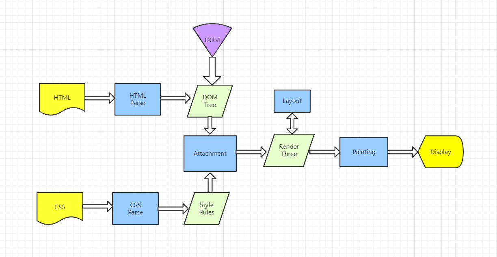
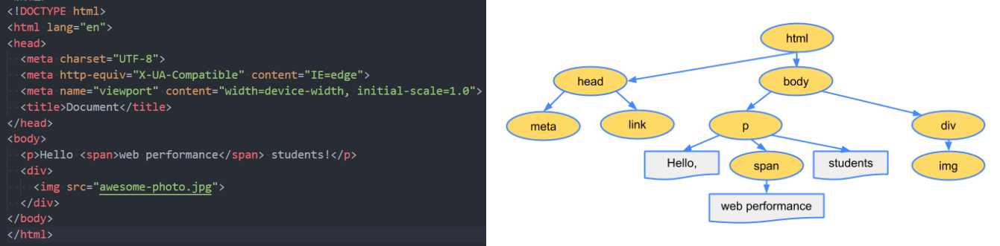
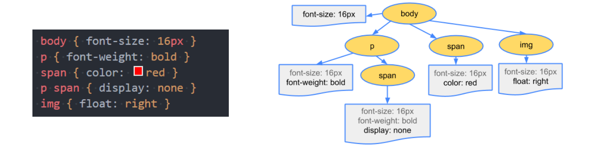
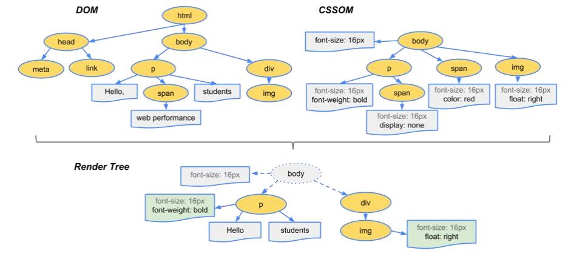

# 页面渲染流程

### 一、渲染引擎
我们经常说的浏览器内核指的是浏览器的排版引擎：排版引擎 (layout engine)，也称为浏览器引擎 (browser engine)、页面渲染引擎 (rendering engine) 或样版引擎；

一个网页下载下来后，就是由我们的渲染引擎来帮助我们解析的；

渲染引擎主要模块：

一个渲染引擎主要包括：HTML 解析器，CSS 解析器，javascript 引擎，布局 layout 模块，绘图模块；

- HTML 解析器：解释 HTML 文档的解析器，主要作用是将 HTML 文本解释成 DOM 树；
- CSS 解析器：它的作用是为 DOM 中的各个元素对象计算出样式信息，为布局提供基础设施；
- Javascript 引擎：使用 Javascript 代码可以修改网页的内容，也能修改 css 的信息，javascript 引擎能够解释 javascript 代码，并通过 DOM 接口和 CSS 树接口来修改网页内容和样式信息，从而改变渲染的结果
- 布局 (layout)：在 DOM 创建之后，Webkit 需要将其中的元素对象同样式信息结合起来，计算他们的大小位置等布局信息，形成一个能表达这所有信息的内部表示模型
- 绘图模块 (paint)：使用图形库将布局计算后的各个网页的节点绘制成图像结果

### 二、渲染流程
渲染引擎在拿到一个页面后，如何解析整个页面并且最终呈现出我们的网页呢？

浏览器渲染页面的整个过程：浏览器会从上到下解析html文档。

结合上图，一个完整的渲染流程如下：

- 渲染进程解析 HTML 内容转换为能够读懂的 DOM 树结构，解析 CSS 为 CSSDOM
- 把 DOM 和 CSSOM 结合起来生成渲染树(Render Tree)
- 渲染树构建好了之后，将会执行布局过程，它将确定每个节点在屏幕上的确切坐标
- 把渲染树展示到屏幕上。再下一步就是绘制，即遍历渲染树，并使用UI后端层绘制每个节点。

#### 1.HTML解析
遇见 HTML 标记，调用 HTML 解析器解析为对应的 token （一个 token 就是一个标签文本的序列化）并构建 DOM 树（就是一块内存，保存着 tokens，建立它们之间的关系）

#### 2.CSS解析
遇见 style/link 标记调用解析器处理 CSS 标记并构建 CSSOM 树。

#### 3.构建 Render Tree
当有了 DOM Tree 和 CSSOM Tree 后，就可以两个结合来构建 Render Tree 了,实际上浏览器会以最快的速度构建渲染树，所以往往构建渲染树和构建DOM树是并行的。

- 注意一： CSS解析不会阻塞 DOM Tree 的构建过程，但是会阻塞 Render Tree 的构建过程

  - 这是因为 Render Tree 在构建时，需要对应的 CSSOM Tree；

- 注意二： Render Tree 和 DOM Tree 并不是一一对应的关系，DOM树和CSS树的构建是并行的

  - 比如对于 display 为 none 的元素，压根不会出现在 render tree 中；

- 注意三： js标签时会阻塞DOM树的构建

  - 当遇到js脚本时 HTML 解析器暂停工作，JavaScript 引擎介入，并执行 script 标签中的这段脚本， 因为这段 JavaScript 脚本修改了 DOM 中第一个 div 中的内容，所以执行这段脚本之后， div 节点内容已经修改为 time.geekbang 了。脚本执行完成之后，HTML 解析器恢复解析过程，继续解析后续的内容，直至生成最终的 DOM。
