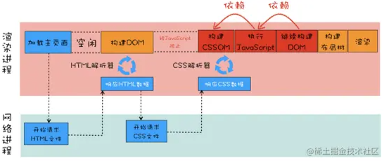
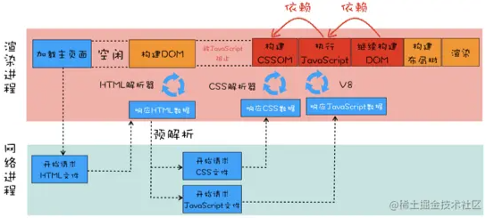

# 页面渲染流程

### 一、渲染引擎
由于浏览器是多进程的，一个页面就是一个进程，这个进程就是浏览器渲染进程，也即是内核。

我们经常说的浏览器内核指的是浏览器的排版引擎：排版引擎 (layout engine)，也称为浏览器引擎 (browser engine)、页面渲染引擎 (rendering engine) 或样版引擎；

一个网页下载下来后，就是由我们的渲染引擎来帮助我们解析的；

渲染进程主要模块：

一个渲染进程主要包括：GUI线程（HTML 解析器，CSS 解析器，布局 layout 模块，绘图模块），javascript 引擎，事件触发线程，定时触发器线程，异步HTTP请求线程。
- GUI线程
  - HTML 解析器：解释 HTML 文档的解析器，主要作用是将 HTML 文本解释成 DOM 树；
  - CSS 解析器：它的作用是为 DOM 中的各个元素对象计算出样式信息，为布局提供基础设施；
  - 布局 (layout)：在 DOM 创建之后，Webkit 需要将其中的元素对象同样式信息结合起来，计算他们的大小位置等布局信息，形成一个能表达这所有信息的内部表示模型
  - 绘图模块 (paint)：使用图形库将布局计算后的各个网页的节点绘制成图像结果

- Javascript 引擎：使用 Javascript 代码可以修改网页的内容，也能修改 css 的信息，javascript 引擎能够解释 javascript 代码，并通过 DOM 接口和 CSS 树接口来修改网页内容和样式信息，从而改变渲染的结果
- 事件触发线程：负责处理JavaScript代码中的事件，如鼠标点击、滚轮滑动等。当事件被触发时，会将事件添加到队列中，等待事件循环线程来处理。
- 定时触发器线程：负责处理JavaScript中的定时器，定时器能使JavaScript代码在指定的时间间隔内执行。
- 异步HTTP请求线程：负责处理JavaScript代码中的异步HTTP请求，以避免阻塞JavaScript引擎线程的执行。

### 二、渲染流程（GUI渲染线程）
渲染引擎在拿到一个页面后，如何解析整个页面并且最终呈现出我们的网页呢？

主要是GUI线程和js线程完成，浏览器渲染页面的整个过程：浏览器会从上到下解析html文档。

结合上图，一个完整的渲染流程如下：

- 渲染进程解析 HTML 内容转换为能够读懂的 DOM 树结构，解析 CSS 为 CSSDOM
- 把 DOM 和 CSSOM 结合起来生成渲染树(Render Tree)
- 渲染树构建好了之后，将会执行布局过程，它将确定每个节点在屏幕上的确切坐标
- 把渲染树展示到屏幕上。再下一步就是绘制，即遍历渲染树，并使用UI后端层绘制每个节点。

#### 1.HTML解析
遇见 HTML 标记，调用 HTML 解析器解析为对应的 token （一个 token 就是一个标签文本的序列化）并构建 DOM 树（就是一块内存，保存着 tokens，建立它们之间的关系），解析遇到link、script、img标签时，浏览器会向服务器发送请求资源。

- script的加载或者执行都会阻塞html解析染线程。（对应浏览器多进程模型中的GUI线程和js线程互斥）
- link加载完css后会解析为CSSOM(层叠样式表对象模型,一棵仅含有样式信息的树)。css的加载和解析不会阻塞html的解析，但会阻塞渲染。
- img的加载不会阻塞html的解析，但img加载后并不渲染，它需要等待Render Tree生成完后才和Render Tree一起渲染出来。未下载完的图片需等下载完后才渲染。

#### 2.CSS解析
遇见 style/link 标记调用解析器处理 CSS 标记并构建 CSSOM 树，DOM树和CSS树的构建是并行的。（实际上这里严格来说应该是并发，因为GUI渲染主线程同一时间只能执行一个操作，这也就意味着parse styleSheet会和 parse Html 抢占主线程资源，个人认为应该是交替进行）。

#### 3.构建 Render Tree
当有了 DOM Tree 和 CSSOM Tree 后，就可以两个结合来构建 Render Tree 了,实际上浏览器会以最快的速度构建渲染树，所以往往构建渲染树和构建DOM树是并行的（这里的并行与上面类似）

- 注意一： CSS解析不会阻塞 DOM Tree 的构建过程，但是会阻塞 Render Tree 的构建过程,这是因为 Render Tree 在构建时，需要对应的 CSSOM Tree；

- 注意二： Render Tree 和 DOM Tree 并不是一一对应的关系，比如对于 display 为 none 的元素，压根不会出现在 render tree 中；

#### 4.布局和绘制

第四步是：在渲染树（Render Tree）上运行布局（Layout） 来计算每个节点的几何体。

- 渲染树会表示显示哪些节点以及其他样式，但是不表示每个节点的尺寸、位置等信息；
- 布局是确定呈现树中所有节点的宽度、高度和位置信息；

第五步是：将每个节点绘制（Paint）到屏幕上。

- 在绘制阶段，浏览器将布局阶段计算的每个 frame 转为屏幕上实际的像素点；
- 包括将元素的可见部分进行绘制，比如文本、颜色、边框、阴影、替换元素（比如 img）

#### 5.回流（重排）和重绘

- 重绘：

  - 第一次渲染内容称之为绘制（paint），之后重新渲染称之为重绘，
  - 重绘不会带来重新布局，所以并不一定伴随重排。浏览器会根据元素的新属性重新绘制，使元素呈现新的外观。
  - 什么属性会导致重绘呢？color background box-shadow.. (比如修改背景色、文字颜色、边框颜色、样式等)

- 回流（重排）：

  - 第一次确定节点的大小和位置，称之为布局（layout），之后对节点的大小、位置修改重新计算称之为回流
  - "重排/回流"必然导致"重绘"，比如改变一个网页元素的位置，就会同时触发"重排"和"重绘"，因为布局改变了，所以回流是一件很消耗性能的事情
  - 什么属性会导致回流呢？width top position.. （比如 DOM 结构发生改变 / 修改了布局）

### 三、页面渲染阻塞的情况

#### 1.页面构建过程

##### （1）页面中只含有外部CSS文件

从图中我们可以看到，在构建布局树之前需要先获取到DOM树与CSSOM树，在请求回HTML文件时，HTML解析器响应HTML数据开始构建DOM，但是由于此时页面中包含的是外部CSS文件，所以他需要先去请求CSS会见，再获取到CSS数据后CSS解析器才能开始构建CSSOM。所以这种情况下CSS没有阻塞DOM的构建，但它阻塞了页面的渲染

##### （2）页面中包含内联JS和外部CSS

从这张图中我们可以看到，HTML解析器在构建DOM过程中如果遇到了JS就会停止构建DOM，先去解析执行JS（因为JS可能会修改DOM）。但是在执行JS脚本之前，如果页面中包含外部CSS或内联CSS，会先将CSS构建成CSSOM，再去执行JS。这也就是上面说到的为什么一般将JS文件放在页面的最底部的原因

##### （3）页面中包含外部JS与外部CSS

从这张图我们可以看到，HTML解析器在解析过程中如果遇到外部CSS与外部JS文件，就会同时发起请求对文件进行下载，这个过程DOM构建的过程会停止，需要等CSS文件下载完成并构建完CSSOM，JS文件下载完成并执行结束，才会开始构建DOM。我们知道CSS会阻塞JS的执行，所以JS必须要等到CSSOM构建完成之后再执行
所以上面我们说的CSS放在头部进行加载，而JS文件放在页面的底部进行加载也就能够解释的通了。

#### 2.CSS和DOM的关系

- css加载不会阻塞DOM的解析

- css加载会阻塞渲染树的构建（当浏览器遇到一个外部CSS文件，一旦CSS文件开始下载，浏览器必须等待CSSOM构建完成后才能进行渲染，也就是说，当遇到一个外部css文件，虽然不会阻塞DOM解析，但是之后的DOM元素不会再渲染在页面上了，要等css下载解析完了才会继续渲染，之前的DOM元素正常渲染）

#### 3.CSS和JS的关系

如果JS脚本的内容是获取元素的样式，那它就必然依赖CSS。因为浏览器无法感知JS内部到底想干什么，为避免样式获取，就只好等前面所有的样式下载完毕再执行JS。但JS文件与CSS文件下载是并行的，CSS文件会在后面的JS文件执行前先加载执行完毕，所以CSS会阻塞后面JS的执行。

- css加载会阻塞js的执行（js的执行需要等到CSS加载解析完成之后）
- css不会阻塞js以及其他资源的加载

#### 4.DOM和JS的关系

- js的加载和执行会阻塞DOM的解析和渲染（js外部脚本链接的加载和执行只会影响后续 Dom 的解析和渲染，对于脚本之前的的 Dom 并不会阻塞它的解析以及渲染，所以DOM元素是可以被获取的，页面上也是有内容的）

